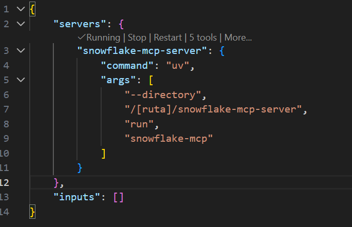

# MCP Server for Snowflake

A Model Context Protocol (MCP) server for performing read-only operations against Snowflake databases. This tool enables Claude to securely query Snowflake data without modifying any information.

This repository is a fork from [snowflake-mcp-server](https://github.com/dynamike/snowflake-mcp-server), from Michael Kania.

## Features

- Flexible authentication to Snowflake using either:
  - Service account authentication with private key
  - External browser authentication for interactive sessions
- Connection pooling with automatic background refresh to maintain persistent connections
- Support for querying multiple views and databases in a single session
- Support for multiple SQL statement types (SELECT, SHOW, DESCRIBE, EXPLAIN, WITH)
- MCP-compatible handlers for querying Snowflake data
- Read-only operations with security checks to prevent data modification
- Support for Python 3.12+
- Stdio-based MCP server for easy integration with Claude Desktop

## Installation

### Prerequisites

- Python 3.12 or higher
- A Snowflake account with either:
  - A configured service account (username + private key), or
  - A regular user account for browser-based authentication

### Installation Steps

#### Option 1: Using uv (Recommended)

1. **Clone this repository**:
   ```bash
   git clone https://github.com/yourusername/snowflake-mcp-server.git
   cd snowflake-mcp-server
   ```

2. **Install uv** (if not already installed):
   
   ```powershell
   pip install uv
   ```
   
   After installation, close and reopen your terminal to refresh the PATH.

3. **Create a virtual environment and install the package**:
   ```bash
   # Create a virtual environment with Python 3.12+
   uv venv
   
   # Activate the virtual environment
   # On Windows:
   .venv\Scripts\activate
   
   # On macOS/Linux:
   source .venv/bin/activate
   
   # Install the package in editable mode
   uv pip install -e .
   ```

4. **Configure your Snowflake credentials**:

   Choose one of the provided example files based on your preferred authentication method:

   **For external browser authentication**:
   ```bash
   cp .env.browser.example .env
   ```
   Then edit the `.env` file to set your Snowflake account details.

   **For private key authentication**:
   ```bash
   cp .env.private_key.example .env
   ```
   Then edit the `.env` file to set your Snowflake account details and path to your private key.

## Usage

### Running in VS Code with Github Copilot

1. In VS Code, press <kbd>Ctrl</kbd> + <kbd>Shift</kbd> + <kbd>P</kbd>, then search for **MCP: Open User Configuration**
3. In this JSON, add a new server with the full path to your uv executable:
   ```yaml
   "snowflake-mcp-server": {
      "command": "uv",
      "args": [
         "--directory",
         "/<path-to-code>/snowflake-mcp-server",
         "run",
         "snowflake-mcp"
      ]
   }
   ```

   
   
   Or explicitly specify the stdio transport:
   
   ```yaml
   "snowflake-mcp-server": {
      "command": "uv",
      "args": [
         "--directory",
         "/<path-to-code>/snowflake-mcp-server",
         "run",
         "snowflake-mcp-stdio"
      ]
   }
   ```
3. Click on **Run** or **Restart**
   
   When using external browser authentication, a browser window will automatically open prompting you to log in to your Snowflake account.

4. If everything is OK, you will see the message: **"Discovered 5 tools"**

Now you can go to GitHub Copilot chat, ensure that the new Tool is available in **Agent mode → Configure Tools**,
and start prompting!


## Available Tools

The server provides the following tools for querying Snowflake:

- **list_databases**: List all accessible Snowflake databases
- **list_views**: List all views in a specified database and schema
- **describe_view**: Get detailed information about a specific view including columns and SQL definition
- **query_view**: Query data from a view with an optional row limit
- **execute_query**: Execute custom read-only SQL queries (SELECT, SHOW, DESCRIBE, EXPLAIN, WITH) with results formatted as markdown tables

### Example Queries

When using with VS Code, you can ask questions like:

- "Can you list all the databases in my Snowflake account?"
- "List all views in the MARKETING database"
- "Describe the structure of the CUSTOMER_ANALYTICS view in the SALES database"
- "Show me sample data from the REVENUE_BY_REGION view in the FINANCE database"
- "Run this SQL query: SELECT customer_id, SUM(order_total) as total_spend FROM SALES.ORDERS GROUP BY customer_id ORDER BY total_spend DESC LIMIT 10"
- "Query the MARKETING database to find the top 5 performing campaigns by conversion rate"
- "Compare data from views in different databases by querying SALES.CUSTOMER_METRICS and MARKETING.CAMPAIGN_RESULTS"

### Configuration

Connection pooling behavior can be configured through environment variables:

- `SNOWFLAKE_CONN_REFRESH_HOURS`: Time interval in hours between connection refreshes (default: 8)

Example `.env` configuration:
```
# Set connection to refresh every 4 hours
SNOWFLAKE_CONN_REFRESH_HOURS=4
```

## Security Considerations

This server:
- Enforces read-only operations (only SELECT, SHOW, DESCRIBE, EXPLAIN, and WITH statements are allowed)
- Automatically adds LIMIT clauses to prevent large result sets
- Uses secure authentication methods for connections to Snowflake
- Validates inputs to prevent SQL injection

⚠️ **Important**: Keep your `.env` file secure and never commit it to version control. The `.gitignore` file is configured to exclude it.

## Contributing

Contributions are welcome! Please feel free to submit a Pull Request.

## Technical Details

This project uses:
- [Snowflake Connector Python](https://docs.snowflake.com/en/developer-guide/python-connector/python-connector) for connecting to Snowflake
- [MCP (Model Context Protocol)](https://github.com/anthropics/anthropic-cookbook/tree/main/mcp) for interacting with Claude
- [Pydantic](https://docs.pydantic.dev/) for data validation
- [python-dotenv](https://github.com/theskumar/python-dotenv) for environment variable management
