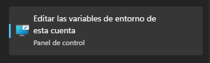
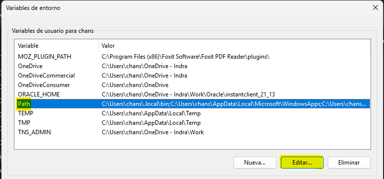
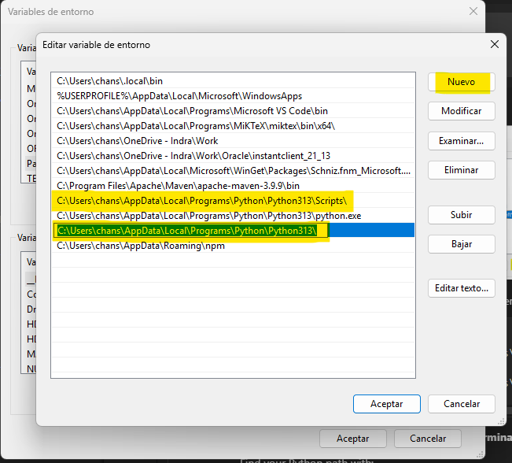
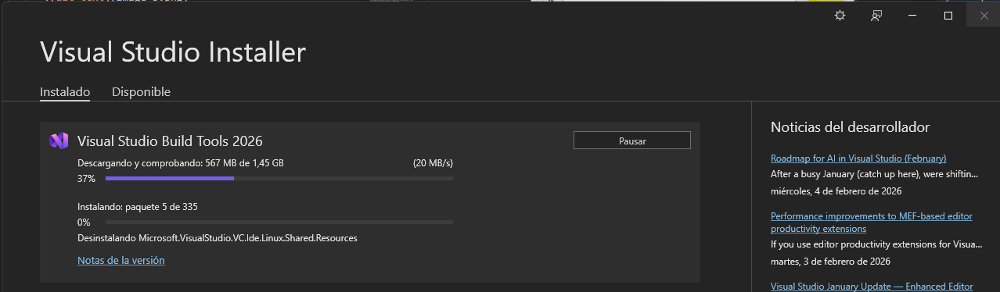
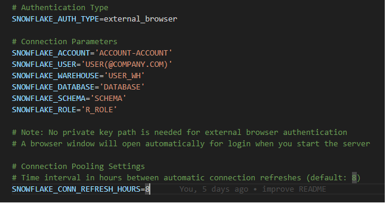
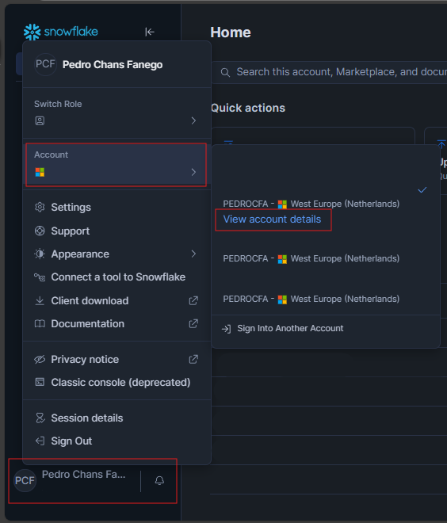
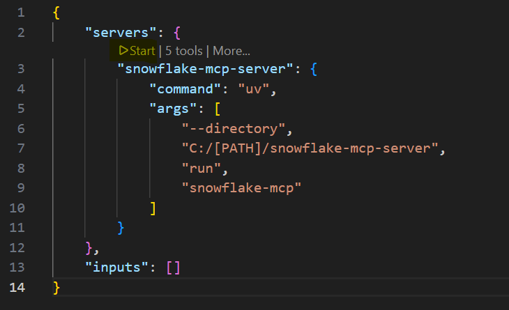
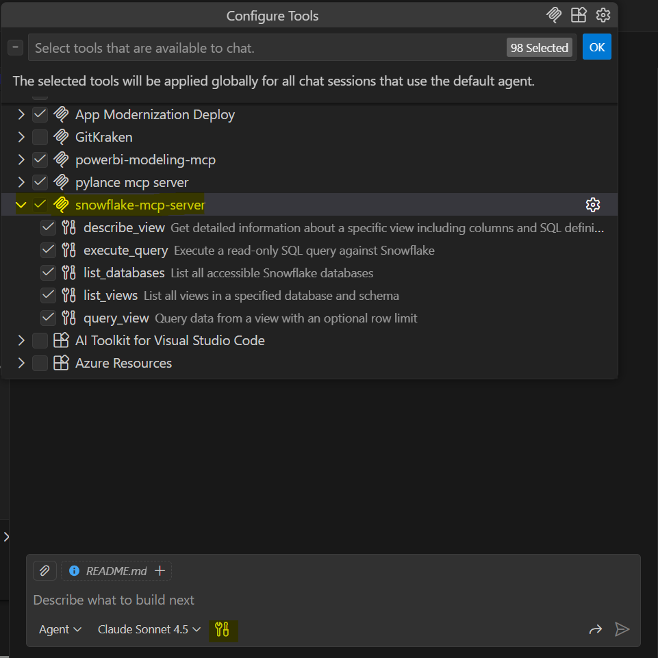
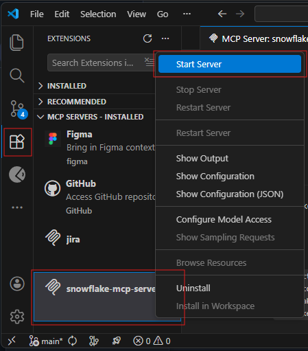

# MCP Server for Snowflake

A Model Context Protocol (MCP) server for performing read-only operations against Snowflake databases. This tool enables Claude to securely query Snowflake data without modifying any information.

This repository is a fork from [snowflake-mcp-server](https://github.com/dynamike/snowflake-mcp-server), from Michael Kania.

## Features

- Flexible authentication to Snowflake using either:
  - Service account authentication with private key
  - External browser authentication for interactive sessions
- Connection pooling with automatic background refresh to maintain persistent connections
- Support for querying multiple views and databases in a single session
- Support for multiple SQL statement types (SELECT, SHOW, DESCRIBE, EXPLAIN, WITH)
- MCP-compatible handlers for querying Snowflake data
- Read-only operations with security checks to prevent data modification
- Support for Python 3.12+
- Stdio-based MCP server for easy integration with Claude Desktop
- **Corporate SSL Certificate Support**: Automatically uses Windows certificate store for SSL connections, ensuring compatibility with corporate environments that use custom or self-signed certificates

## Installation

### Prerequisites

1. **Python 3.12 or higher**
   
   Install Python from [python.org](https://www.python.org/downloads/). During installation, **check "Add Python to PATH"**.
   
   Verify installation:
   ```powershell
   python --version
   ```

2. **Python in PATH**
   
   If Python is not recognized, add it to your PATH:
   
   - In the search bar, go to **Edit environment variables in this account**

      
   
   - In **User variables**, select `Path` and click **Edit**

      

   - Click **New** and add your Python installation path. You can find your Python path with:
      ```powershell
      python -c "import sys; print(sys.prefix)"
      ```

      

   - Click **OK** in all windows and **restart your terminal**


3. **Microsoft Visual C++ Build Tools**
   
   Required for installing Python packages with native dependencies.
   
   Download and install from [Visual Studio Build Tools](https://visualstudio.microsoft.com/visual-cpp-build-tools/):
   - Run the installer
   - Select **"Desktop development with C++"**
   - Click Install

   


>[!WARNING]
> If you have installed any of the prerequisites above (Python, Visual C++ Build Tools, or modified PATH), **restart your computer** before proceeding with the following installation steps.

### Installation Steps

Follow the next steps by executing the commands in your terminal. **Preferably use cmd instead of powershell**.

1. **Clone this repository**:
   ```bash
   git clone https://github.com/pedrochans/snowflake-mcp-server.git
   ```   
   ```bash
   cd snowflake-mcp-server
   ```

2. **Install uv**:
   
   ```powershell
   pip install uv
   ```
   
   Verify installation:
   ```powershell
   uv --version
   ```

3. **Create a virtual environment and install the package**:
   
   Create a virtual environment with Python 3.12+:
   ```bash
   uv venv
   ```
   
   Activate the environment
   ```bash
   # Windows:
   .venv\Scripts\activate

   # macOS/Linux:
   source .venv/bin/activate
   ```
   
   Install the package in editable mode:
   ```bash
   uv pip install -e .
   ```
   
   **Verify the installation**:
   ```powershell
   # You should see snowflake-mcp-server listed
   uv pip list
   ```
   
   > [!NOTE]
   > Si encuentras problemas de compatibilidad entre tu versión de Python y las librerías, pide ayuda a Copilot para encontrar versiones compatibles.

4. **Configure your Snowflake credentials**:

   Choose one of the provided example files based on your preferred authentication method:

   **For external browser authentication**:
   ```bash
   # Linux:
   cp .env.browser.example .env

   # Windows:
   copy .env.browser.example .env
   ```
   Then edit the `.env` file to set your Snowflake account details.

   **For private key authentication**:
   ```bash
   # Linux:
   cp .env.private_key.example .env

   # Windows:
   copy .env.private_key.example .env
   ```

   Then edit the `.env` file to set your Snowflake account details or path to your private key.

   Use simple quotes  `'` , after editing the `.env` file, it should look like this, with your credentials:

   

   If you are lost in this step, you can find your Snowflake account details in Snowsight > Profile > View Account Details:

   

## Usage

### Running in VS Code with Github Copilot

1. In VS Code, press <kbd>Ctrl</kbd> + <kbd>Shift</kbd> + <kbd>P</kbd>, then search for **MCP: Open User Configuration**
3. In this JSON, add a new server with the full path to your uv executable:
   ```json
   "snowflake-mcp-server": {
      "command": "uv",
      "args": [
         "--directory",
         "/<path-to-code>/snowflake-mcp-server",
         "run",
         "snowflake-mcp"
      ]
   }
   ```

This is an example of how the entire JSON file should look like if you have only this MCP installed:

   ```json
   {
      "servers": {
         "snowflake-mcp-server": {
            "command": "uv",
            "args": [
               "--directory",
               "/<path-to-code>/snowflake-mcp-server",
               "run",
               "snowflake-mcp"
            ]
         }
      },
      "inputs": []
   }
   ```
   
   Alternative option: explicitly specify the stdio transport:
   
   ```json
   "snowflake-mcp-server": {
      "command": "uv",
      "args": [
         "--directory",
         "/<path-to-code>/snowflake-mcp-server",
         "run",
         "snowflake-mcp-stdio"
      ]
   }
   ```
3. After that, click on **Start** or **Restart**

   
   
   When using external browser authentication, a browser window will automatically open prompting you to log in to your Snowflake account.

4. If everything is OK, you will see the message: **"Discovered 5 tools"**

Now you can go to GitHub Copilot chat, ensure that the new Tool is available in **Agent mode → Configure Tools**,
and start prompting!

<p align="center">
  
</p>

5. Now, the only thing you have to do every time you want to use it is start the MCP server like this:

   


Authenticate, and just ask Copilot to query some data in Snowflake! 

## Available Tools

The server provides the following tools for querying Snowflake:

- **list_databases**: List all accessible Snowflake databases
- **list_views**: List all views in a specified database and schema
- **describe_view**: Get detailed information about a specific view including columns and SQL definition
- **query_view**: Query data from a view with an optional row limit
- **execute_query**: Execute custom read-only SQL queries (SELECT, SHOW, DESCRIBE, EXPLAIN, WITH) with results formatted as markdown tables. Supports:
  - SHOW commands for metadata (TABLES, PIPES, TASKS, STREAMS, GRANTS, PROCEDURES, FUNCTIONS, etc.)
  - INFORMATION_SCHEMA queries for detailed object metadata
  - SNOWFLAKE.ACCOUNT_USAGE queries for historical and audit data (requires permissions)

### Example Queries

When using with VS Code, you can ask questions like:

- "Can you list all the databases in my Snowflake account?"
- "List all views in the MARKETING database"
- "Describe the structure of the CUSTOMER_ANALYTICS view in the SALES database"
- "Show me sample data from the REVENUE_BY_REGION view in the FINANCE database"
- "Run this SQL query: SELECT customer_id, SUM(order_total) as total_spend FROM SALES.ORDERS GROUP BY customer_id ORDER BY total_spend DESC LIMIT 10"
- "Query the MARKETING database to find the top 5 performing campaigns by conversion rate"
- "Compare data from views in different databases by querying SALES.CUSTOMER_METRICS and MARKETING.CAMPAIGN_RESULTS"
- "Show me all tables in the SALES schema"
- "Find all columns named 'customer_id' across all tables in the database"
- "Show me all stored procedures in the ETL schema"
- "List all pipes that load data into the RAW_DATA database"
- "Show the query history for the last hour"
- "What tasks are scheduled to run in this database?"

### Configuration

Connection pooling behavior can be configured through environment variables:

- `SNOWFLAKE_CONN_REFRESH_HOURS`: Time interval in hours between connection refreshes (default: 8)

Example `.env` configuration:
```
# Set connection to refresh every 4 hours
SNOWFLAKE_CONN_REFRESH_HOURS=4
```

## Security Considerations

This server:
- Enforces read-only operations (only SELECT, SHOW, DESCRIBE, EXPLAIN, and WITH statements are allowed)
- Automatically adds LIMIT clauses to prevent large result sets
- Uses secure authentication methods for connections to Snowflake
- Validates inputs to prevent SQL injection

⚠️ **Important**: Keep your `.env` file secure and never commit it to version control. The `.gitignore` file is configured to exclude it.

## Contributing

Contributions are welcome! Please feel free to submit a Pull Request.

## Technical Details

This project uses:
- [Snowflake Connector Python](https://docs.snowflake.com/en/developer-guide/python-connector/python-connector) for connecting to Snowflake
- [MCP (Model Context Protocol)](https://github.com/anthropics/anthropic-cookbook/tree/main/mcp) for interacting with Claude
- [Pydantic](https://docs.pydantic.dev/) for data validation
- [python-dotenv](https://github.com/theskumar/python-dotenv) for environment variable management
- [pip-system-certs](https://pypi.org/project/pip-system-certs/) for corporate SSL certificate support on Windows
